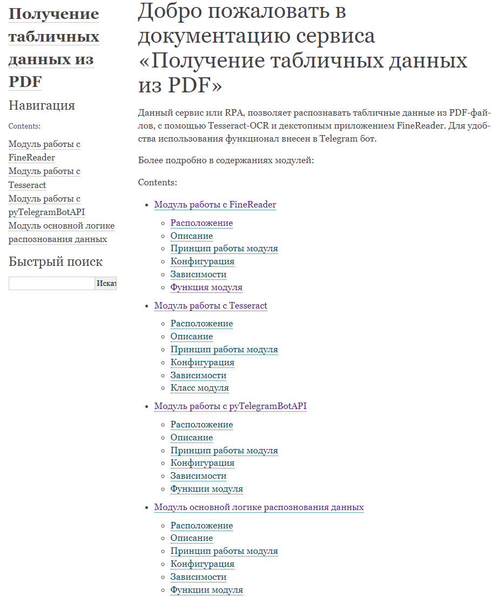
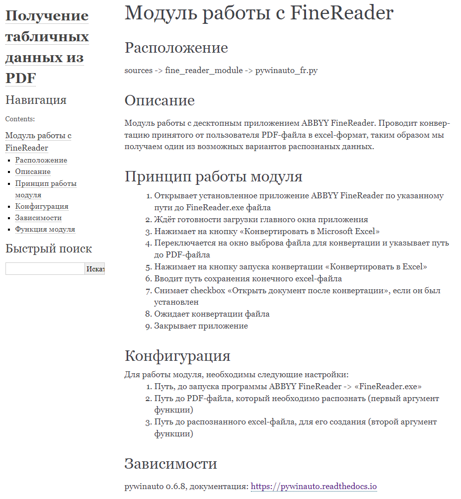
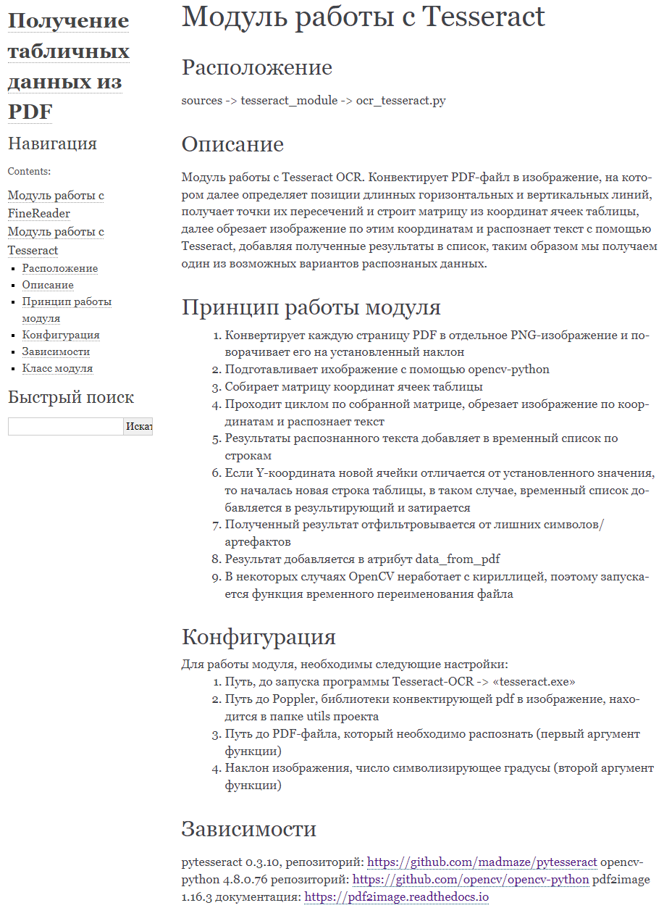

## Получение табличных данных из PDF-файла
Сервис/RPA для получения табличных данных из PDF файла двумя способами:
 - с помощью Tesseract-OCR
 - с помощью декстопного FineReader

Вывод результатов распознавания идёт в excel-файл, на разных листах.
Для удобства использования, весь функционал выведен в Telegram бот и реализован на кнопках.

*Некоторые особенности*:   
Конфигурация проекта построена на Pydantic - BaseSettings, с чтением файла конфигурации toml из переменных среды и 
валидацией значений. Работа с FineReader введётся исключительно на селекторах и не использует скриншоты. Логика модуля
Tesseract основана на поиске пересечений горизонтальных и вертикальных линий, получения координат ячеек таблицы и 
распознавания обрезанного изображения по всем полученным координатам.

## Зависимости:
- Управление зависимостями: poetry
- Работа с десктопными приложениями: pywinauto
- OCR: pytesseract, opencv-python, pdf2image
- Работа с табличными данными: pandas
- Telegram бот: pytelegrambotapi
- Конфигурация и валидация проекта: pydantic-settings
- Тестирование: pytest
- Покрытие unit-тестами: pytest-cov
- Документация: sphinx

## Coverage

## Документация
[Документация Sphinx](docs/build/index.html)

Превью документации:

